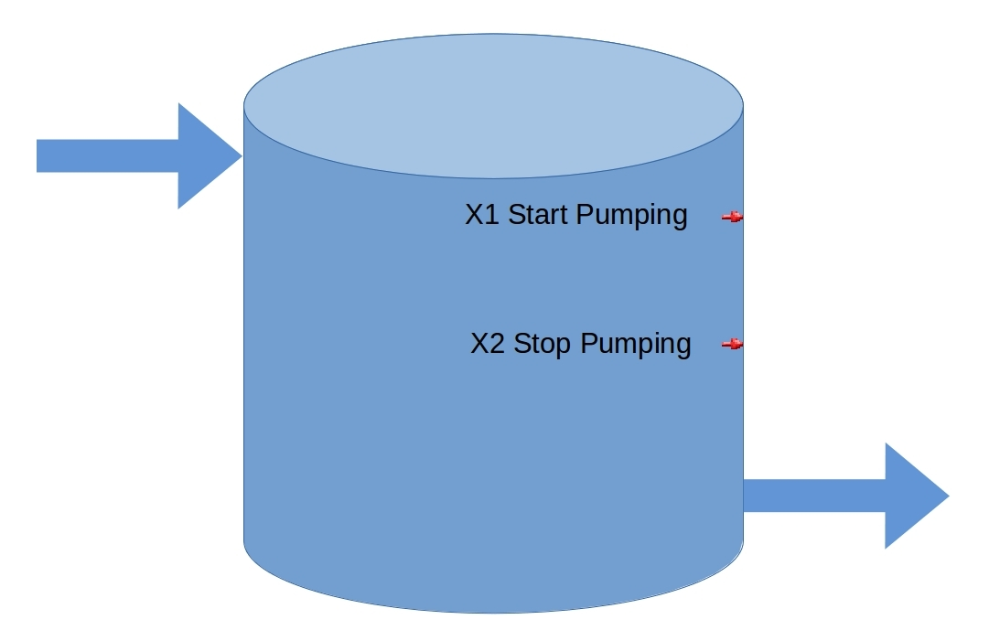

# Pump Station 01
Example pump station code. 
Overly simple - experimenting with git and [Automation Direct's Do-more Designer 1.4.3](http://support.automationdirect.com/products/domore.html).

When the high level is reached, X1, start pumping until the low level is reached, X2.

